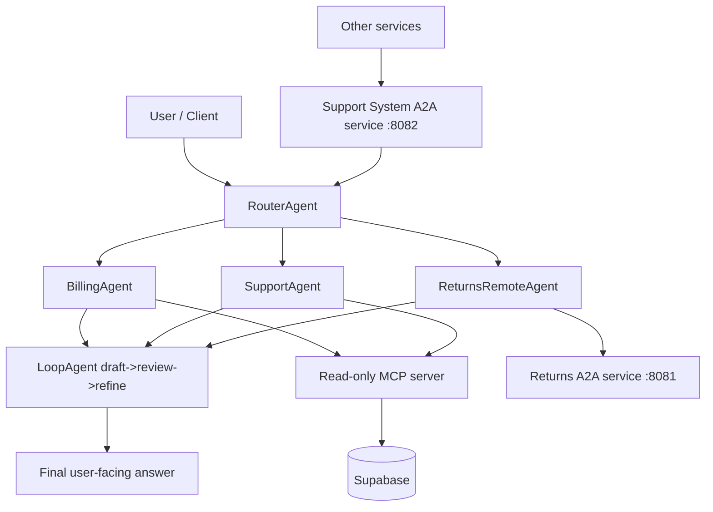

# Multi-Agent Customer Support System with MCP and A2A

**Multi-Agent Customer Support System with MCP and A2A** — a Python reference app where a **RouterAgent** classifies customer messages and delegates to specialists: **BillingAgent** and **SupportAgent** (data via Supabase, exposed through MCP-style tools), and **ReturnsRemoteAgent** (remote **Agent-to-Agent** protocol to a dedicated returns FastAPI service).

## Architecture



- **MCP → Supabase**: `src/mcp/supabase_mcp_server.py` exposes `get_billing_info` / `get_support_tickets` over stdio MCP; the same logic is called in-process from agents via `FunctionTool`.
- **A2A → Returns Service**: `servers/returns_service/main.py` serves an ADK agent over A2A; `ReturnsRemoteAgent` connects using the Agent Card URL.

## Tech Stack

- Google ADK (`google-adk`), A2A SDK (`a2a-sdk`), MCP (`mcp`), FastMCP, FastAPI, Uvicorn, Gradio (local UI), Supabase (`supabase`), `httpx`, `python-dotenv`

## Stretch Goals Implemented

- **LoopAgent**: Added `src/agents/loop_agent.py` with deterministic draft -> review -> refine processing before responses are returned.
- **Tool Filtering (read-only MCP)**:
  - MCP tools are explicitly documented as read-only in `src/mcp/supabase_mcp_server.py`.
  - Agents enforce allowlisted tools via `src/agents/tool_filter.py` and per-agent `ALLOWED_MCP_TOOLS`.
- **Eval Test Cases**: Added `tests/test_eval_scenarios.py` with 5+ mocked pytest scenarios covering billing, returns eligibility/initiation, escalation, and general support.
- **Support System A2A**:
  - Added `src/a2a/support_system_a2a.py` exposing the full system as one high-level A2A tool: `handle_support_query`.
  - Optional service wrapper at `servers/support_system_service/main.py`.

## Project Structure

```text
multi_agent_customer_support/
  sql/
    schema_and_seed.sql    # DDL + seed data
    fix_rls_and_verify.sql # RLS policies + checks (run after schema if needed)
  src/
    main.py                 # FastAPI + CLI entry (`python -m src.main`)
    gradio_app.py           # Gradio UI (`python -m src.gradio_app`)
    agents/
      router_agent.py
      billing_agent.py
      support_agent.py
      returns_remote_agent.py
    mcp/
      supabase_mcp_server.py
      supabase_mcp_connection.py
  servers/returns_service/main.py  # Returns A2A microservice
  servers/support_system_service/main.py  # Full support-system A2A service
  tests/
  .env.example
  README.md
```

## Setup

### 1. Supabase: project, schema, and seed

1. Create a project in [Supabase](https://supabase.com).
2. In the SQL editor (or `psql`), run:
   - `sql/schema_and_seed.sql` — tables, seed rows, and dev-oriented RLS as provided.
   - If you hit RLS / permission issues with the anon key, run `sql/fix_rls_and_verify.sql` and re-check policies.

### 2. Environment variables

Copy and edit:

```bash
cp .env.example .env
```

Typical variables:

| Variable | Purpose |
|----------|---------|
| `SUPABASE_URL` | Project URL |
| `SUPABASE_ANON_KEY` | Anon key (or `SUPABASE_KEY` legacy) |
| `GEMINI_API_KEY` or `GOOGLE_API_KEY` | ADK / Gemini for router and agents |
| `RETURNS_SERVICE_URL` | Returns service base URL (default `http://127.0.0.1:8081`) |
| `RETURNS_A2A_AGENT_CARD_URL` | Optional full Agent Card URL override |

### 3. Install dependencies

Python **3.12** recommended.

```powershell
cd multi_agent_customer_support
py -3.12 -m venv .venv
.\.venv\Scripts\Activate.ps1
python -m pip install --upgrade pip
pip install -e .
pip install -e ".[dev]"   # optional: pytest + pytest-asyncio
```

### 4. Run the Supabase MCP server (separate process)

From `multi_agent_customer_support/`:

```powershell
python -m src.mcp.supabase_mcp_server
```

Uses stdio MCP; configure Cursor or other MCP hosts to launch this command with the same working directory and `.env` loaded.

### 5. Run the Returns FastAPI (A2A) service

```powershell
uvicorn servers.returns_service.main:app --host 127.0.0.1 --port 8081
```

Or: `python -m servers.returns_service.main`  
Agent card: `GET http://127.0.0.1:8081/.well-known/agent-card.json`

### 5b. Run the Support System A2A service (optional)

This exposes the whole pipeline (Router + specialists + Loop) as one external A2A agent.

```powershell
uvicorn servers.support_system_service.main:app --host 127.0.0.1 --port 8082
```

Or: `python -m servers.support_system_service.main`  
Agent card: `GET http://127.0.0.1:8082/.well-known/agent-card.json`

### 6. Run the main CLI

```powershell
python -m src.main
```

Optional: `CLI_CUSTOMER_ID` in `.env` to skip the customer-id prompt.  
Type `quit` or `exit` to stop.

### 7. Gradio UI (interactive testing)

From ``multi_agent_customer_support/`` (same ``.env`` as the CLI). Uses the **same** ``RouterAgent`` as the API—no separate FastAPI process required. For returns questions, keep the returns service on port **8081** running.

```powershell
python -m src.gradio_app
```

Open the URL shown in the terminal (default **http://127.0.0.1:7860**). Optional: ``GRADIO_SERVER_PORT`` / ``GRADIO_SERVER_NAME`` to change bind address and port.

### Run the HTTP API (optional)

```powershell
uvicorn src.main:app --reload --port 8000
```

Example:

```bash
curl -X POST http://127.0.0.1:8000/support/query \
  -H "Content-Type: application/json" \
  -d "{\"customer_id\":\"you@example.com\",\"message\":\"I was charged twice\"}"
```

Response includes `result`, `routed_to`, `escalated`, and `rationale`.

## Example conversations (CLI)

Use a **real seeded customer email** from Supabase when testing billing/support data.

### Billing

```text
> I was charged twice for my last order. Can you check my billing?
```

Expect routing to **billing** and a summary grounded in `get_billing_info` / orders.

### Returns

```text
> I want to return order ORD-123. Am I eligible for a refund?
```

Expect routing to **returns** and an answer from the remote **Returns** A2A agent (returns service must be running with `GEMINI_API_KEY`).

### Escalation

```text
> My account was hacked, all my orders are gone, and nobody is helping me.
```

For high-severity or ambiguous cases the router may return an **escalation** response (`[ESCALATE]`, `ESCALATE_FLAG`) so a human can take over; exact behavior may use the LLM router when API keys are set, or heuristics when not.

## Tests

```powershell
pytest tests/
```

Scenario tests live in `tests/test_scenarios.py`.
Eval-style coverage is in `tests/test_eval_scenarios.py`.

## A2A Example: `handle_support_query`

### Direct HTTP tool helper (support system service)

```bash
curl -X POST http://127.0.0.1:8082/tools/handle_support_query \
  -H "Content-Type: application/json" \
  -d "{\"query\":\"I was charged twice for my last order, can you check?\"}"
```

Example response shape:

```json
{
  "final_answer": "I reviewed your billing details and found ...",
  "review_notes": ["Review passed: clear, concise, and directly answers the question."],
  "routed_to": "billing",
  "escalate": false,
  "rationale": "billing/payment keywords",
  "customer_id": "demo@example.com"
}
```

### A2A JSON-RPC request (same service)

```bash
curl -X POST http://127.0.0.1:8082/ \
  -H "Content-Type: application/json" \
  -d "{\"jsonrpc\":\"2.0\",\"id\":\"1\",\"method\":\"message/send\",\"params\":{\"message\":{\"role\":\"user\",\"parts\":[{\"kind\":\"text\",\"text\":\"Please start a return for order 987654 because it arrived damaged.\"}],\"message_id\":\"m1\",\"kind\":\"message\"}}}"
```
